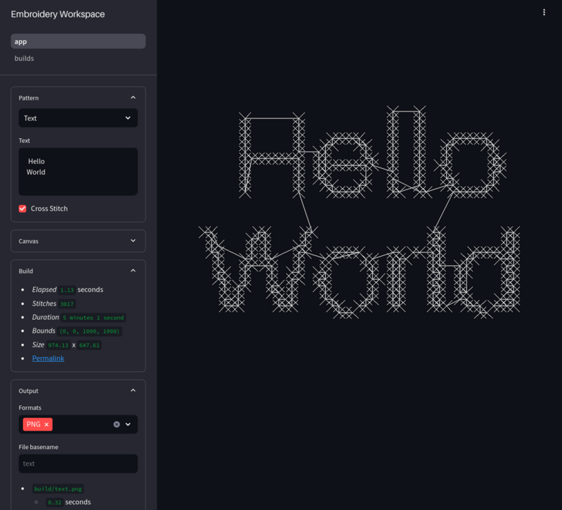

# embroidery-workspace

Streamlit app for generating embroidery patterns using pyembroidery.

Patterns are classes that implement `Pattern` and are defined in `patterns/$NAMESPACE/*.py`.
Refer to [`patterns/examples`](patterns/examples) for examples.

Pattern namespaces may also define a newline delimited `packages.txt` and `requirements.txt` file to install
Debian and Python dependencies into the Docker image.
